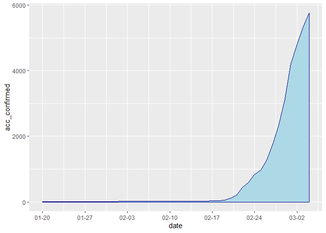
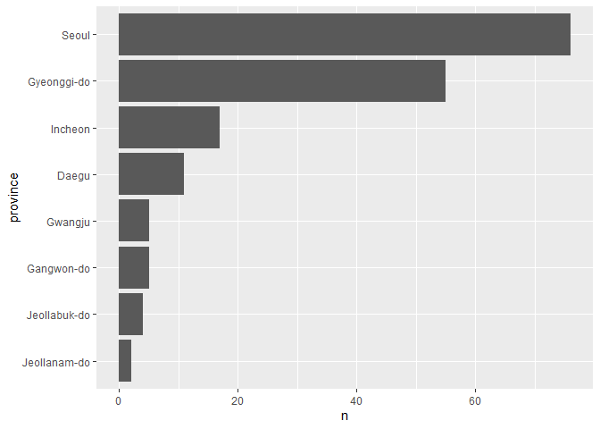

<!-- README.md is generated from README.Rmd. Please edit that file -->

# corona19

R package for import datasets of Coronavirus disease 2019 in South Korea
from [Coronavirus-Dataset
repository](https://github.com/jihoo-kim/Coronavirus-Dataset).

-----

## Installation

``` r
# install.packages("remotes")
remotes::install_github("youngwoos/corona19")
```

## Example

``` r
library(corona19)

# state
state <- getdata("state")
state
#> # A tibble: 45 x 11
#>    date       acc_test acc_negative acc_confirmed acc_released acc_deceased
#>    <date>        <int>        <int>         <int>        <int>        <int>
#>  1 2020-01-20        1            0             1            0            0
#>  2 2020-01-21        1            0             1            0            0
#>  3 2020-01-22        4            3             1            0            0
#>  4 2020-01-23       22           21             1            0            0
#>  5 2020-01-24       27           25             2            0            0
#>  6 2020-01-25       27           25             2            0            0
#>  7 2020-01-26       51           47             3            0            0
#>  8 2020-01-27       61           56             4            0            0
#>  9 2020-01-28      116           97             4            0            0
#> 10 2020-01-29      187          155             4            0            0
#> # ... with 35 more rows, and 5 more variables: new_test <int>,
#> #   new_negative <int>, new_confirmed <int>, new_released <int>,
#> #   new_deceased <int>

library(ggplot2)
ggplot(data = state, aes(x = date, y = acc_confirmed)) + 
  geom_area(color="darkblue", fill="lightblue") + 
  scale_x_date(date_breaks = "weeks" , date_labels = "%m-%d")
```



``` r

# patient
patient <- getdata("patient") 
patient
#> # A tibble: 5,766 x 14
#>       id sex   birth_year country region group infection_reason infection_order
#>    <int> <chr>      <int> <chr>   <chr>  <chr> <chr>                      <int>
#>  1     1 fema~       1984 China   filte~ <NA>  visit to Wuhan                 1
#>  2     2 male        1964 Korea   filte~ <NA>  visit to Wuhan                 1
#>  3     3 male        1966 Korea   capit~ <NA>  visit to Wuhan                 1
#>  4     4 male        1964 Korea   capit~ <NA>  visit to Wuhan                 1
#>  5     5 male        1987 Korea   capit~ <NA>  visit to Wuhan                 1
#>  6     6 male        1964 Korea   capit~ <NA>  contact with pa~               2
#>  7     7 male        1991 Korea   capit~ <NA>  visit to Wuhan                 1
#>  8     8 fema~       1957 Korea   Jeoll~ <NA>  visit to Wuhan                 1
#>  9     9 fema~       1992 Korea   capit~ <NA>  contact with pa~               2
#> 10    10 fema~       1966 Korea   capit~ <NA>  contact with pa~               3
#> # ... with 5,756 more rows, and 6 more variables: infected_by <int>,
#> #   contact_number <int>, confirmed_date <date>, released_date <date>,
#> #   deceased_date <date>, state <chr>

ggplot(data = patient, aes(x = 2020-birth_year, fill = sex, colour = sex)) + 
  geom_density(alpha = 0.3) +
  xlab("age")
```


``` r

# route
route <- getdata("route") 

library(dplyr)
cnt_visit <- route %>% 
  count(visit, sort = T) %>% 
  head(10)

cnt_visit
#> # A tibble: 10 x 2
#>    visit                 n
#>    <chr>             <int>
#>  1 hospital_isolated    19
#>  2 airport              13
#>  3 restaurant           13
#>  4 hospital             10
#>  5 clinic                8
#>  6 etc                   7
#>  7 train_station         7
#>  8 market                5
#>  9 store                 5
#> 10 hair_salon            3

ggplot(cnt_visit, aes(x = reorder(visit, n), y = n)) + 
  geom_col() + 
  coord_flip() +
  xlab("visit")
```



## Dataset infomation

### 1\. state

  - **date**: 일자
  - **acc\_test**: 누적 검사 수 (진행 중인 검사 포함)
  - **acc\_negative**: 누적 음성 결과 수
  - **acc\_confirmed**: 누적 양성 결과 수 (확진)
  - **acc\_released**: 누적 격리 해제 수
  - **acc\_deceased**: 누적 사망 수
  - **new\_test**: 신규 검사 수
  - **new\_negative**: 신규 음성 결과 수
  - **new\_confirmed**: 신규 양성 결과 수 (확진)
  - **new\_released**: 신규 격리 해제 수
  - **new\_deceased**: 신규 사망 수

### 2\. patient

  - **id**: 확진자의 id (n번째 확진자)
  - **sex**: 성별
  - **birth\_year**: 출생 연도
  - **country**: 국적
      - Korea: 대한민국
      - China: 중국
      - Mongolia: 몽골
  - **region**: 주 활동 지역 (광역시/도 단위)
      - capital area: 수도권 (서울특별시/인천광역시/경기도)
      - filtered at airport: 공항 검역 이후 활동하지 않은 경우
      - Busan: 부산광역시
      - Daegu: 대구광역시
      - Daejeon: 대전광역시
      - Gwangju: 광주광역시
      - Ulsan: 울산광역시
      - Gangwon-do: 강원도
      - Chungcheongbuk-do: 충청북도
      - Chungcheongnam-do: 충청남도
      - Jeollabuk-do: 전라북도
      - Jeollanam-do: 전라남도
      - Gyeongsangbuk-do: 경상북도
      - Gyeongsangnam-do: 경상남도
      - Jeju-do: 제주도
  - **group**: 특정 집단 관련
      - Shincheonji Church: 신천지 관련
      - Cheongdo Daenam Hospital: 청도대남병원 관련
      - Eunpyeong St. Mary’s Hospital: 은평성모병원 관련
      - Onchun Church: 온천 교회 관련
      - Myungsung Church: 명성 교회 관련
      - Pilgrimage: 이스라엘 성지순례 관련
  - **infection\_reason**: 감염 경로
      - visit to ooo: 감염 위험 나라/도시 방문
      - contact with patient: 국내 확진자와 접촉
      - contact with patient in ooo: 해외 확진자와 접촉
      - residence in Wuhan: 중국 우한 거주
      - pilgrimage to Israel: 이스라엘 성지순례
  - **infection\_order**: 감염 차수 (n차 감염)
  - **infected\_by**: 해당 확진자의 감염원 id
  - **contact\_number**: 접촉자 수
  - **confirmed\_date**: 확진 일자
  - **released\_date**: 퇴원 일자 (격리 해제 일자)
  - **deceased\_date**: 사망 일자
  - **state**: 상태
      - isolated: 입원 (격리)
      - released: 퇴원 (격리 해제)
      - deceased: 사망

### 3\. route

  - **id**: 확진자의 id (n번째 확진자)
  - **date**: 일자
  - **province**: 특별시/광역시/도
  - **city**: 시/군/구
  - **visit**: 방문한 장소 (종류)
      - airport: 공항
      - hospital\_isolated: 격리된 병원
      - hospital: 대형급 병원 또는 보건소
      - clinic: 의원급 병원
      - hotel: 호텔
      - store: 소형 가게
      - market: 대형 마트
      - restaurant: 식당
      - cafe: 카페
      - company:  
      - bus\_terminal: 버스 터미널
      - train\_station: 기차역
      - movie\_theater: 영화관
      - hair\_salon: 미용실
      - church: 교회
      - etc: 기타 방문 장소
  - **latitude**: 위도
  - **longitude**: 경도
